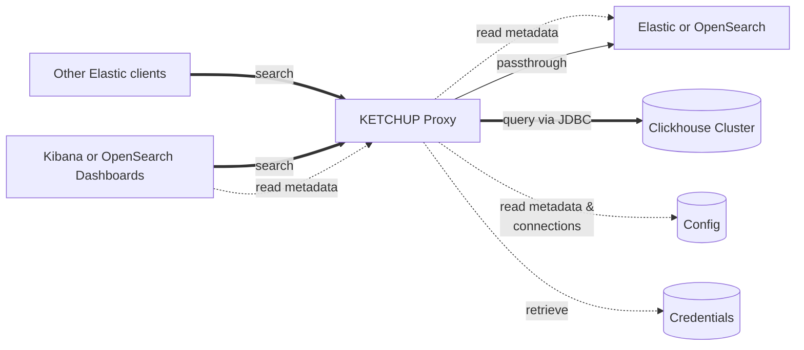

# ketchup
Kibana Elastic Translation Clickhouse User Proxy

## What is it?
This is primarily a "simple" reverse proxy that emulates several ElasticSearch/OpenSearch APIs, and depending on its 
configuration and the nature of the request, either translates queries to SQL and dispatches them to Clickhouse-
compatible servers, or passes requests through to an underlying Elasticsearch or OpenSearch server.

## Maturity
🚨 **_Definitely not ready for production use!_** 🚨

## License
[Apache 2.0](./LICENSE). 

## Feature Set

### Query Semantics

#### What Works
* aggregation queries
    * `date_histogram` as a top-level aggregation
        * `min`, `max`, etc. can be nested underneath it

    * `min`, `max`, `avg`, `sum`, `value_count`, and `cardinality` as top-level aggregations
        * we make no distinction between `value_count` and `cardinality`, they both currently translate to `COUNT(*)`.

    * `movingFn` aggregations are supported under certain conditions:
        * The `script` _MUST_ match the regex `MovingFunctions\.(.*?)\(values\)`
            * The functions we support are (moving) `max`, `min`, `sum`, and `unweightedAvg`.
        * The `buckets_path` _MUST_ reference a bucket aggregation that has already been translated, i.e. is an ancestor
          or older sibling
        * The `window` parameter is required
        * The `shift` parameter is not supported (yet?)

    * `terms` as a top-level aggregation
        * the "other bucket" that counts the number of values that weren't in the top-k isn't populated (it will make the
          SQL _really_ hairy)
        * not correctly translated when not top-level

* non-aggregation queries
    * The way SQL result columns are divided between `_source` and `fields` is a heuristic at best
    * When no projections are requested, we just return the ID field, assuming there is one in the metadata--maybe we'd
      want some notion of default fields?

#### What Doesn't Work
* `terms` aggregations when not top-level
* Search targets with wildcards currently only work when the target string is mapped literally, e.g. if you ask for
  <nobr>`GET /my-cluster-*:awesome-index-*/_search`</nobr> your mapping configuration files will need to mention
  <nobr>`my-cluster-*:awesome-index-*`</nobr> as an index name or alias.
    * TODO find a place in metadata to model the full cluster and index names, for more precise matching
* queries that target multiple clusters/indexes, e.g. <nobr>`GET /foo,bar/_search`</nobr> -- currently we just take the
  first one
    * TODO make this work if everything winds up pointing to the same DB after resolving the cluster/index names
* queries that want to use aggregations AND return documents in the same query (i.e. `aggs != null AND size != 0`) --
  only the aggregation side of the query will be attempted.
* In aggregation queries, `hits.total.value` is the size of the result set after the results have already been reduced
  by a `GROUP BY`, not the number of records that matched the filter criteria before aggregation.
* In `moving_fn` aggregations, the following functions are not supported (yet?):
    * `stdDev()`
    * `linearWeightedAvg()`
    * `ewma()`
    * `holt()`
    * `holtWinters()`
* Basically every kind of aggregation not listed [above](#what-doesnt-work)!
* Compatibility with OpenSearch is untested, and may have significant gaps

## Selected Roadmap Items

### Security
The proxy server doesn't participate in Elastic/OpenSearch security mechanisms other than passing through
non-query requests and maintaining its own cookie cache.

Running the proxy with TLS _may_ be a simple matter of adding the appropriate ktor directives to
[application.conf](./elastic-proxy-server/src/main/resources/application.conf) but isn't tested. 

### Async Client
We currently use [ktor](https://ktor.io/) for our (async) service implementation, but the (sync) java HTTP client for
talking to backends. We should use ktor's client library for the backend connections too, so we could get by with fewer 
threads.

### Query IR, Expression AST
We use a home-grown intermediate representation for [queries](./model/src/main/kotlin/io/hydrolix/ketchup/model/query/query.kt) 
and [expressions](./model/src/main/kotlin/io/hydrolix/ketchup/model/expr/Expr.kt), because we couldn't find anything 
that looked obviously better that would fit within our timeline. [Substrait](https://substrait.io/) might be a 
future candidate.

## Architecture Overview


## Building
```
./gradlew clean build
```

## Modules
 * [elastic-proxy-server](./elastic-proxy-server) is the main module; most of this README is about it
 * [cli-query-translator](./cli-query-translator) is a standalone command-line utility that attempts to translate
   Elastic queries to Clickhouse-flavoured SQL without needing to connect to anything, and without attempting to run
   anything. It has [its own README](./cli-query-translator/README.md).
 * [kibana-proxy-server](./kibana-proxy-server) is a (currently non-functional) experiment in providing functionality
   similar to `elastic-proxy-server` except it's intended to sit in front of Kibana/OpenSearch Dashboards, and supports
   Kibana/OpenSearch Dashboards APIs instead of Elastic/OpenSearch. In some deployment scenarios, this would be much 
   easier to experiment with if it was restored to full function.
 * Several internal libraries not designed for reuse:
   * [kql-parsing-scala](./kql-parsing-scala) implements a KQL/Lucene parser using the excellent 
     [Fastparse](https://github.com/com-lihaoyi/fastparse) library which doesn't really have a Kotlin equivalent
     (yes, I tried `h0tk3y/better-parse`!)
   * [model](./model) contains our configuration and metadata domain models, and the query IR/AST 
   * [server-common](./server-common) is stuff that would be useful for both `elastic-proxy-server` and 
     `kibana-proxy-server`.
   * [util](./util) is the usual util package, generic stuff that's used widely
 * [hydrolix-specific](./hydrolix-specific) is some tooling that only applies to [Hydrolix](https://hydrolix.io)
   rather than Clickhouse generally.

## Running
```
./gradlew :elastic-proxy-server:shadowJar

java -jar elastic-proxy-server/build/libs/elastic-proxy-server-all.jar

curl -d '{"query":{"query_string":{"query":"(new york city) OR (big apple)"}}}' \
    http://localhost:19200/my_index/_search
```

## Configuration
Configuration is mainly loaded from JSON files referenced by URLs contained within environment variables. Have a look at
[application.conf](./elastic-proxy-server/src/main/resources/application.conf) for more info, but we'll summarize here:

### Configuration Notes
Q. Why are these all URLs instead of paths? \
A. Because you might want your configuration files to be on a cloud storage medium someday!

### Misc
`LISTEN_PORT` is the TCP port the proxy should listen on; it defaults to `19200`.

### DB Mappings
`DB_MAPPINGS_JSON_URL` is a URL (not a filesystem path!) that contains an array of
[DBMapping](./model/src/main/kotlin/io/hydrolix/ketchup/model/config/DBMapping.kt) objects, each of which maps an
Elastic index name, and optionally aliases, to a particular Clickhouse Connection, referencing it by its UUID.
If not set, defaults to `file:dbMappings.json`.

A DBMappings file looks like this:
```json
  [
      {
          "indexPattern": "my-cluster*:my-index",
          "indexPatternIds": [],
          "clickHouseConnectionId": "<uuid>",
          "elasticConnectionId": "<uuid>",
          "clickHouseTableName": "my_db.my_table",
          "idFieldName": "id",
          "defaultFields": []
      }
  ]
```

### Elastic Connections
`ELASTICSEARCH_CONNECTIONS_JSON_URL` is a URL that contains an array of one or more
[ElasticsearchConnection](./model/src/main/kotlin/io/hydrolix/ketchup/model/config/ElasticsearchConnection.kt) objects.
If not set, defaults to `file:elasticConnections.json`.

An ElasticsearchConnections file looks like this:
```json
  [
      {
          "id": "<uuid>",
          "name": "My Elastic cluster",
          "created": "1970-01-01T00:00:00Z",
          "url": "http://10.10.0.137:9200/",
          "vendor": "Elastic",
          "default": true,
          "extraProperties": {}
      }
  ]
```

### Clickhouse Connections
`CLICKHOUSE_CONNECTIONS_JSON_URL` is a URL that contains an array of one or more
[ClickhouseConnection](./model/src/main/kotlin/io/hydrolix/ketchup/model/config/ClickhouseConnection.kt) objects.
Note that credentials should be stored in a [credential](#credentials) file, not here.

If not set, defaults to `file:clickhouseConnections.json`.

A ClickhouseConnections file looks like this:
```json
[
    {
        "id": "<uuid>",
        "created": "1970-01-01T00:00:00Z",
        "legacyDriver": false,
        "url": "jdbc:clickhouse://127.0.0.1:8123/my_db",
        "extraProperties": {
            "compress": "false"
        }
    }  
]
```

### Elastic Metadata Mappings
`ELASTIC_METADATA_JSON_URLS.<0..n>` are numbered URLs; each one points to a single
[ElasticMetadata](./model/src/main/kotlin/io/hydrolix/ketchup/model/config/ElasticMetadata.kt) document describing how a
particular Elastic/OpenSearch index is mapped to an SQL schema. Have a look at
[the source](./model/src/main/kotlin/io/hydrolix/ketchup/model/config/ElasticMetadata.kt), it's too much to explain here.

There's no default value, and query translation _can_ work without ElasticMetadata, but query translations can be wrong,
e.g. nested field references like `foo.bar` will be left as-is, resulting in invalid SQL in most such cases.

### Credentials
`CREDENTIALS_JSON_URL` is a URL that contains an array of one or more
[CredentialEntry](./model/src/main/kotlin/io/hydrolix/ketchup/model/config/CredentialEntry.kt) objects where credentials
can be stored separately from connection metadata. These JSON files are the only implementation of
credential storage at the moment, but we anticipate building more, e.g. for Kubernetes Secrets, AWS Secret Manager, or
other cloud providers' equivalents.

The `id` of the CredentialEntry must match that of a configured (elastic, clickhouse, etc.) connection to be useful.

If not set, defaults to `file:credentials.json`.

A Credentials file looks like this:

```json
  [
      {
          "id": "<uuid>",
          "created": "1970-01-01T00:00:00Z",
          "username": "admin",
          "credential": "5uper_S3cre7"
      }
  ]
```
